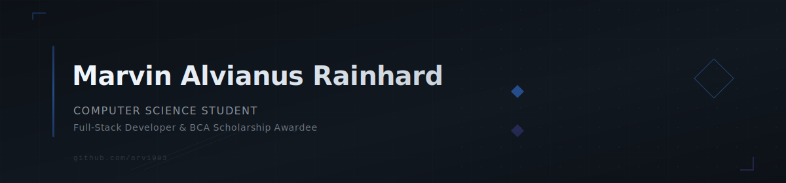

<p align="center">
  
</p>

<p align="center">
  
</p>

**Computer Science at BINUS University** | **BCA Scholarship (PPTI) 2025 Awardee**

I build full-stack applications and am increasingly focused on artificial intelligence, machine learning, and systems programming. My work spans React-based dashboards, Google Apps Script automation, Python backends, and Android development — always with an emphasis on practical, cost-effective solutions.

---

### Featured Project

<p align="center">
  <a href="https://github.com/arv1903/Root">
    
  </a>
</p>

**[Root](https://github.com/arv1903/Root)** is a zero-cost personal finance tracker built for Indonesian banks. It automatically parses transaction emails from Gmail, categorizes spending, and surfaces insights on a dark-mode React dashboard. The entire pipeline runs on free tiers — Google Apps Script, Supabase, and Vercel. No manual entry, no LLM APIs, no paid services.

```
React 19 · TypeScript · Tailwind CSS · shadcn/ui · Framer Motion · visx · Three.js
Google Apps Script · Supabase (PostgreSQL) · clasp
```

> Spending trends with animated charts · Smart category detection · Budget tracking · SHA-256 auth · PWA-ready

---

### Tech Stack

**Frontend**

<p>
  
  
  
  
  
  
</p>

**Backend**

<p>
  
  
  
  
  
  
  
</p>

**Languages**

<p>
  
  
  
  
  
</p>

**Mobile**

<p>
  
  
</p>

**Data, ML & Infrastructure**

<p>
  
  
  
  
  
  
  
</p>

**Hardware & Tools**

<p>
  
  
</p>

---

### Currently Learning

<p>
  
  
  
</p>

Working through the fundamentals — linear algebra, PyTorch, neural network architectures, and Rust's ownership model. Building in public as I go.

---

### Achievements

**Competitions**

- **1st Place** — BMEC 2024: Biomedical Engineering Olympiad
- **3rd Place** — Technology Euphoria 2023: Competitive Programming
- **2nd Place** — ILPC: Informatics Logical Programming Competition
- **Finalist (Top 10)** — KIHAJAR STEM 2024
- **Finalist** — Kompetisi Sains Nasional (IPS)

**Programs**

- Green Youth Movement Indonesia — 2023/2024

---

### Stats

<p align="center">
  
  
</p>

<p align="center">
  
</p>

<p align="center">
  
</p>

---

### 💡 Dev Quote / Joke

<p align="center">
  
</p>

---

### Certifications

- HSK (Chinese Proficiency Test)

---

### Connect

<p>
  <a href="https://www.linkedin.com/in/marvinalvianus-rainhard-195171340">
    
  </a>
  <a href="mailto:marvin07ar@gmail.com">
    
  </a>
  <a href="https://open.spotify.com/user/xsjqmoks6x7vilb26ts8cciym">
    
  </a>
  <a href="https://instagram.com/marvin_ar">
    
  </a>
  
</p>
