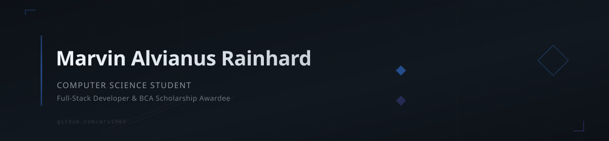

  

  

**A normal student**

I tinker with code, build cool stuff, and pretend I know what I'm doing. Mostly full-stack apps, but lately I've been poking at AI/ML and systems programming because why not. React dashboards, Python backends, Android apps — if it's free and useful, I'm probably hacking on it.

---

### Tech Stack

**Frontend**

  
  
  
  
  
  

**Backend**

  
  
  
  
  
  
  

**Languages**

  
  
  
  
  

**Mobile**

  

**Data, ML & Infrastructure**

  
  
  
  
  
  
  

**Hardware & Tools**

  
  

---

### Currently Learning

  
  
  

Currently nerding out over linear algebra, PyTorch, and neural networks. Also trying to tame Rust — the ownership model keeps me humble.

---

### Connect

  
  
  
  
  

